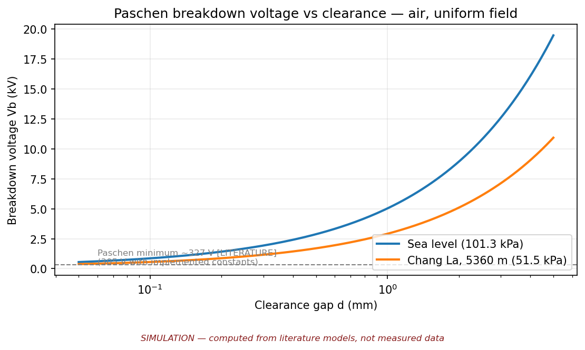
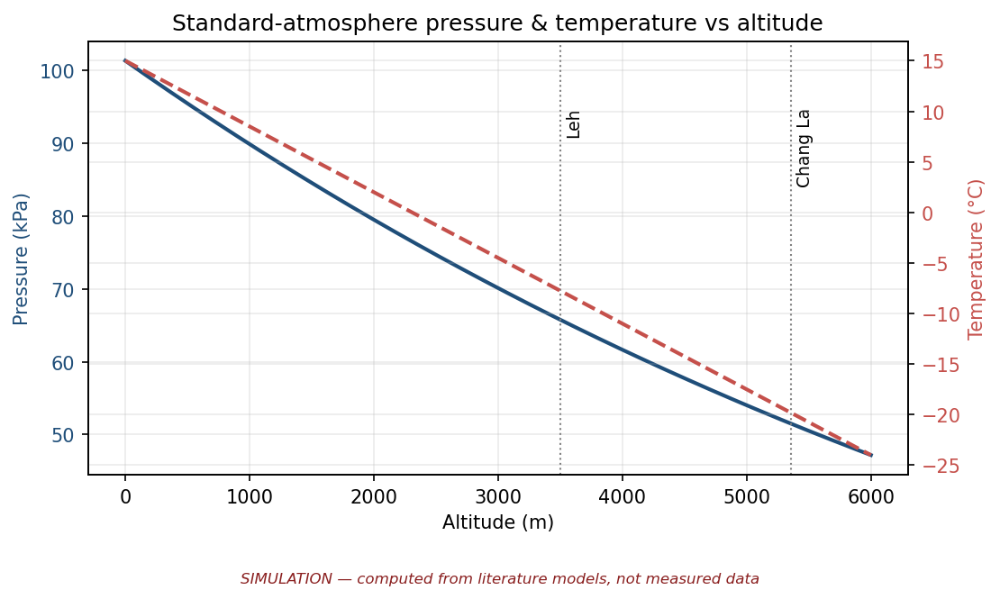

# HIMKAVACH

**SIH26049 — DRDO · Smart India Hackathon 2026 · Team ALPHA 20**

> A physics-guided reliability screening and decision-support system for
> electrical/electronic equipment under subzero temperature and low-pressure
> high-altitude conditions (Ladakh HAA/SHAA).

[](https://himkavach.grok.me)


| [🚀 Live Demo](https://himkavach.grok.me) | [🏗 Architecture](docs/architecture/himkavach-architecture.png) | [📚 Documentation](docs/physics/README.md) | [🧪 Validation](docs/validation/VALIDATION_PLAN.md) |
|---|---|---|---|

## For Evaluators — the 2-minute tour

1. **See it work (60 s):** open the [HIMKAVACH Live Simulator](https://himkavach.grok.me) →
   pick the *Chang La extreme (−40 °C)* preset → watch pressure, clearance
   margin, junction temperature and battery retention recompute, then open the
   **Report** tab for the verdict and equations.
2. **Check the honesty (30 s):** every number on the site and in this repo
   carries a label — `[COMPUTED]`, `[LITERATURE]`, `[ESTIMATE]`, `[ASSUMPTION]`
   or `[SIMULATION]`. Nothing measured is claimed; the `MEASURED` column is
   empty by design.
3. **Reproduce it (30 s):** one command regenerates every figure in this repo
   from code — see [Reproduce everything](#reproduce-everything).

## Contents

- [What is it?](#what-is-it)
- [Why does it matter?](#why-does-it-matter)
- [Why DRDO cares](#why-drdo-cares)
- [Key results at a glance](#key-results-at-a-glance)
- [How does it work?](#how-does-it-work)
- [What is actually implemented? What remains?](#what-is-actually-implemented-what-remains)
- [The problem](#the-problem)
- [Proposed solution](#proposed-solution)
- [Simulation outputs](#simulation-outputs)
- [🚀 Live Demo — HIMKAVACH Live Simulator](#-live-demo--himkavach-live-simulator)
- [Repository map](#repository-map)
- [Reproduce everything](#reproduce-everything)
- [Tech stack](#tech-stack)
- [Limitations (read before citing this work)](#limitations-read-before-citing-this-work)
- [Why HIMKAVACH?](#why-himkavach)
- [Label legend](#label-legend)
- [Security](#security)


## What is it?

HIMKAVACH takes a Ladakh operating environment (pressure, temperature,
humidity), runs it through three literature physics models — **thermal**,
**HV/insulation breakdown**, **cold-battery behaviour** — and returns a
screening verdict (**PASS / REVIEW / REDESIGN**) plus mitigation
recommendations. Every prediction is then checked against physical
measurement; **the model loses every tie.**

## Why does it matter?

At 5,360 m (Chang La), air pressure is ≈ 51 kPa — half of sea level.
That single fact simultaneously weakens natural convection, cuts
insulation strength by ~40% (Paschen's law), and combines with −20 °C cold
to slash battery capacity. Equipment qualified for the plains fails in
Ladakh for these three coupled reasons. HIMKAVACH screens for all three
*before* hardware is committed.

## Why DRDO cares

Deep-research pass, 30 Sep 2026 — every fact below carries its source;
secondary sources are marked as such. Full citations in
[`docs/references/REFERENCES.md`](docs/references/REFERENCES.md).

- The Indian Army permanently stations troops in the High Altitude and
  Super High Altitude Areas of Ladakh and Siachen. Winter clothing for
  these troops is officially specified to withstand temperatures
  **below −50 °C** (PIB, Lok Sabha reply, 3 Feb 2017) `[LITERATURE]`.
- High-altitude troops are officially issued **electronic** aids —
  avalanche victim detectors and trackers — and DRDO's Defence
  Geo-Informatics Research Establishment (DGRE) operates 39 observatories
  and automated weather stations feeding near-real-time avalanche warning
  bulletins to them (PIB, 10 Dec 2021) `[LITERATURE]`. Electronics are
  already part of the high-altitude system.
- DRDO's Defence Institute of Physiology & Allied Sciences (DIPAS)
  developed the Him-Taapak space-heating device for troops in Eastern
  Ladakh and Siachen; the Army placed orders worth over ₹420 crore (ANI,
  Jan 2021, quoting the DIPAS Director — secondary source)
  `[LITERATURE]`.
- India's military environmental standard **JSS 55555** treats
  cold-plus-thin-air as a distinct qualification case: **Test No. 3
  (Altitude)** covers equipment "under simultaneously applied Service
  conditions of low air pressure and high or low temperature"; Test No. 20
  is Low Temperature (from an unofficial copy of JSS 55555:2012 Rev. 3 —
  the spec is a controlled document with no official free text)
  `[LITERATURE, secondary copy]`.
- iDEX ran a challenge (DISC-11) for −50 °C-capable tank
  starter-generators and ultra-capacitors on the stated premise that
  conventional batteries fail in extreme cold (secondary news; official
  challenge page not located) `[LITERATURE, secondary]`.
- Honesty note: we found **no verifiable public incident** of electronic
  equipment failing specifically because of altitude, low pressure, or
  cold. The problem statement asserts observed field effects; we treat
  them as the qualification gap to screen for, not as documented
  incidents.

## Key results at a glance

All values below are produced by the code in `simulation/` or cited from
literature — see [Label legend](#label-legend).

| Quantity | Sea level | Chang La (5,360 m) | Label |
|---|---|---|---|
| Air pressure | 101.3 kPa | **51.5 kPa** | `[COMPUTED]` |
| Breakdown voltage, 0.8 mm bare gap | 4,198 V | **2,446 V** | `[COMPUTED]` (Paschen's law) |
| Paschen minimum (air) | 327 V | 327 V | `[LITERATURE]` |
| Usable battery capacity at −20 °C | 100% | **≈ 80%** | `[LITERATURE]` (per-datasheet, chemistry-specific) |
| Twin-board prototype cost | — | ≈ ₹6,700 | `[ESTIMATE]` — verify before purchase |

## How does it work?

```
Environment → Physics Models → Electronics Risk Analysis
    → Mitigation Recommendation → Physical Validation → Model Calibration
```

The calibration loop is the point: twin-board experiments (E1/E3) replace
assumed model parameters with measured ones.

## What is actually implemented? What remains?

**IMPLEMENTED** — live web simulator ([HIMKAVACH Live Simulator](https://himkavach.grok.me));
physics library + 4 CLI tools (`simulation/`); risk engine; architecture
diagram; full docs (physics, validation plan, BOM, references, roadmap).

**SIMULATED** — every number and graph in this repo (all marked
`SIMULATION`): Paschen curves, convection penalty, battery derating,
clearance analysis.

**CONCEPTUAL** — reference photos in `assets/conceptual/` (explicitly not
evidence of a built prototype); hand-pump vacuum desiccator as *partial*
low-pressure simulation.

**TO BE BUILT** — twin-board ESP32 prototype (≈ ₹6,700 [ESTIMATE], BOM
ready, nothing purchased).

**FUTURE VALIDATION** — E1 thermal, E2 insulation (simulation-only for
students — safety), E3 cold battery; accredited chamber; Ladakh field
validation.

**MEASURED** — nothing yet. No prototype exists; no measurements are
claimed anywhere in this repository.

## The problem

Electronics in Ladakh face three coupled stresses:

- **Low pressure** (~51 kPa at Chang La) — thinner air insulates less
  (breakdown voltage falls) and convects less (components run hotter).
- **Subzero temperature** (≈ −20 °C nominal) — batteries lose usable
  capacity; materials and lubricants change behaviour.
- **Reduced convection** — the same wattage produces a larger temperature
  rise than at sea level.
- **Insulation/breakdown stress** — a 0.8 mm clearance rated 4.2 kV at sea
  level withstands only ~2.4 kV at Chang La [COMPUTED, Paschen's law].
- **Cold battery conditions** — ~80% usable capacity at −20 °C
  [LITERATURE, per-datasheet, chemistry-specific].

## Proposed solution

HIMKAVACH is a **physics-guided reliability screening and
decision-support system**. It is explicitly **not** a fully validated
qualification system — it screens designs cheaply, recommends mitigations,
and earns trust through the measurement loop, not through claims.

### Three mechanisms

1. **Thermal** — lumped convection+radiation model; convection derated with
   pressure (`h ∝ (p/p0)^0.8` [ASSUMPTION] — the parameter E1 will calibrate).
2. **Electrical insulation / breakdown** — Paschen's law; clearance
   screening sea-level vs Ladakh.
3. **Cold-battery behaviour** — temperature derating of usable capacity and
   internal resistance for a 2S 18650 pack.

## Simulation outputs

Every figure below is **SIMULATION** — generated by `generate_figures.py`
from the physics models, stamped on the figure itself. No measurements.



*Paschen curve for air, sea level vs Chang La. The 0.8 mm operating point
drops from 4,198 V to 2,446 V — [COMPUTED].*



*Standard-atmosphere pressure and temperature vs altitude, marking Chang La
(5,360 m, 51.5 kPa) — [COMPUTED].*

More figures (thermal convection penalty, battery derating, clearance
analysis) live in [`screenshots/graphs/`](screenshots/graphs/) — all
marked SIMULATION.

## 🚀 Live Demo — HIMKAVACH Live Simulator

**[▶ Open the HIMKAVACH Live Simulator](https://himkavach.grok.me)**

Audited live on 30 Sep 2026 — every item below was confirmed present on
the site. (Export/download buttons were seen but not click-tested.)

- **7 modules:** Mission · Air · Clearance · Thermal · Battery · Life · Report
- **Global inputs:** altitude (default 5,364 m) and ambient temperature
  (default −14.4 °C) sliders; computed pressure (51.44 kPa), density, and
  IEC clearance-factor stat cards, all badged `[COMPUTED]`
- **8 site/month presets:** Chang La Jan / Dec / Feb / extreme (−40 °C),
  Leh town Jan / Dec / Feb, and a sea-level lab for comparison
- **Sea-level-vs-Ladakh comparison table** (Mission page: pressure,
  clearance margin, junction temperature, battery retention)
- **Clearance:** working voltage, conductor spacing, coating and
  internal/external toggles; "Required spacing vs altitude" and Paschen
  curve charts; PASS/FAIL margin badges
- **Thermal:** "Tj vs altitude" and "Pmax vs altitude" charts, sensitivity
  table, lumped board map, and mitigation buttons (lower load, better
  package, add cooling)
- **Battery:** "Retention vs cell temperature" chart with literature
  anchors (the −40 °C point flagged estimate), heater/preheat controls,
  FAIL / charge-blocked banners
- **Life:** Arrhenius acceleration-factor chart and predicted-life estimate
- **Report:** entries list, verdicts, before/after comparison, numbered
  equations (1–8), verbatim assumptions, standards section (IPC-2221,
  IEC 60664-1, ISA/ICAO, IMD Leh normals, JSS 55555), **Save as PDF** and
  **CSV exports**
- Honest labelling throughout: `[COMPUTED]` / `[LITERATURE]` /
  `[ESTIMATE]` / `[SIMULATION]` badges and explicit disclaimers —
  *"not a digital twin and not a certification."*

The deployed web app's frontend source is not vendored in this repository;
this repo holds the physics, documentation, and reproducible models behind it.

## Repository map

```
README.md                      ← you are here
docs/
  architecture/                ← himkavach-architecture.png + .svg
  physics/                     ← equations, assumptions, limitations
  validation/                  ← VALIDATION_PLAN.md (E1/E2/E3)
  bom/                         ← BOM.md (ESTIMATE — verify before purchase)
  references/                  ← real citations only
simulation/
  common/physics.py            ← shared library (documented models)
  paschen/  thermal/  battery/  risk-engine/   ← CLI tools + examples
  requirements.txt
screenshots/graphs/            ← generated outputs, all marked SIMULATION
assets/conceptual/             ← reference visuals + PHOTO_STATUS.md
hardware/
  roadmap/                     ← staged plan, [DONE] vs [PLANNED]
  component-list/              ← twin-board sensor map
generate_figures.py            ← regenerates every figure in this repo
```

## Reproduce everything

```bash
cd simulation && pip install -r requirements.txt
python3 common/physics.py && python3 paschen/paschen_curve.py \
  && python3 thermal/thermal_model.py && python3 battery/battery_model.py \
  && python3 risk-engine/risk_engine.py
cd .. && python3 generate_figures.py   # every figure in this repo
```

## Tech stack

- **Models & simulation:** Python 3, NumPy, Matplotlib (`simulation/`,
  `generate_figures.py`)
- **Live simulator:** deployed web app at [himkavach.grok.me](https://himkavach.grok.me)
  (frontend source not vendored — this repo holds the physics behind it)
- **Docs & figures:** Markdown, SVG/PNG generated from code — no
  hand-drawn charts, no screenshots passed off as data

## Limitations (read before citing this work)

- No accredited environmental chamber — all "altitude" results are computed,
  and the only planned physical pressure test is a *partial* hand-pump
  vacuum desiccator, honestly framed.
- No field validation in Ladakh yet.
- The thermal model's convection exponent (0.8) is an assumption awaiting E1.
- The battery derating curve below −20 °C is an engineering estimate awaiting E3.
- E2 (insulation) stays simulation-only: students do not build HV rigs.
- Prototype limitations: twin-board freezer tests are relative comparisons,
  not absolute altitude qualification.
- No measurements exist yet — the `MEASURED` category above is empty by design.

## Why HIMKAVACH?

Detailed solvers (Ansys Sherlock, Siemens PollEx, COMSOL) and qualification
standards (JSS 55555, MIL-810H) already exist — HIMKAVACH **complements**
them, it does not replace them. The intended niche is a **low-cost,
field-oriented, altitude-specific screening + physical correlation
workflow**: cheap literature models up front, twin-board measurements that
calibrate those models, and a risk verdict a field engineer can act on —
before expensive chamber time is booked.

## Label legend

`[LITERATURE]` published value · `[COMPUTED]` produced by `simulation/`
code · `[ESTIMATE]` verify before acting · `[ASSUMPTION]` team modelling
choice · `[SIMULATION]` unmeasured model output. Full definitions in
[`docs/physics/README.md`](docs/physics/README.md).

## Security

No secrets are committed to this repository — no API keys, passwords,
tokens, `.env` files, or credentials of any kind.

---

*Team ALPHA 20 · SIH 2026 · Problem Statement SIH26049 (DRDO) · Round-2
submission track: simulation + architecture. Prototype build follows the
[roadmap](hardware/roadmap/README.md).*
